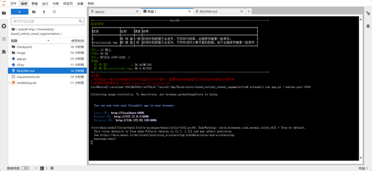
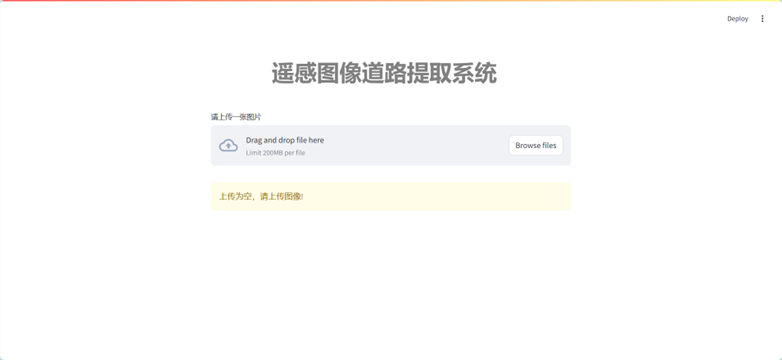
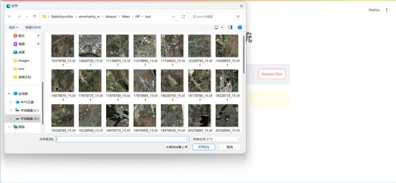
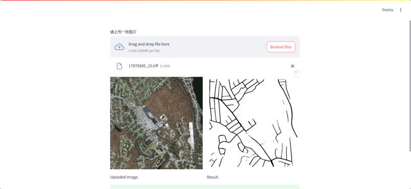

# 基于UGD-DLinkNet的遥感图像道路提取系统

```
UGD-DLinkNet/
├── model_traing/        # 训练遥感图像道路提取算法UGD-DLinkNet的代码
│   ├── model/           # 构建算法的模型文件
│   ├── tools/           # 数据集预处理文件，包括标签构建和图像裁剪
│   ├── utils/           # 算法训练过程中的辅助性文件
│   ├── convert.py       # 算法训练过程中的辅助性文件
│   ├── test.py          # 测试算法效果的文件
│   ├── test_deep.py     # 测试DeepGlobe数据集效果的文件
│   ├── test_mass.py     # 测试马赛诸塞州道路数据集效果的文件
│   ├── test_s.py        # 测试算法效果的文件
│   ├── train.py         # 训练道路提取算法的文件文件
│   ├── train_deep.py    # 使用DeepGlobe数据集训练算法的文件
│   ├── train_mass.py    # 使用马赛诸塞州道路数据集训练算法的文件
├── system_deploy/       # 遥感图像道路提取算法的系统部署代码
│   ├── checkpoint/      # 存放训练好的道路提取算法权重的文件夹
│   ├── images/          # 系统效果相关截图
│   ├── models/          # 存放UGD-DLinkNet网络结构的文件夹
│   ├── app.py           # Streamlit系统前端页面的主文件
│   ├── clf.py           # Streamlit系统后台推理的主文件
│   ├── README.md        # readme
│   ├── requirements.txt # 系统依赖以及安装包
│   ├── test.ipynb       # 测试文件
```

## 安装步骤如下

conda create -n web python=3.11

source activate web

conda install pytorch torchvision torchaudio pytorch-cuda=11.8 -c pytorch -c nvidia

pip install streamlit

注意不要使用requirements.txt进行环境安装，因为在部署阶段streamlit cloud也是直接连接到github仓库中，在streamlit cloud中已经存在streamlit的环境。

## 系统运行代码
在终端切换到当前文件夹的命令下

streamlit run app.py

如果只能使用特定端口（比如AUTODL平台），可使用以下指令指定端口
streamlit run app.py --server.port 6006

## 部署
请参看streamlit官方说明，此代码的环境是python3.11，同样需要在streamlit cloud创建中选择好python版本 https://docs.streamlit.io/

## 部署效果
### 整体效果


### 系统后台界面


### 系统前端网页


### 选择图片上传


### 显示原图与道路提取结果



## 系统说明
上图中左侧是上传的遥感图像，模型推理后将显示右侧的道路提取结果