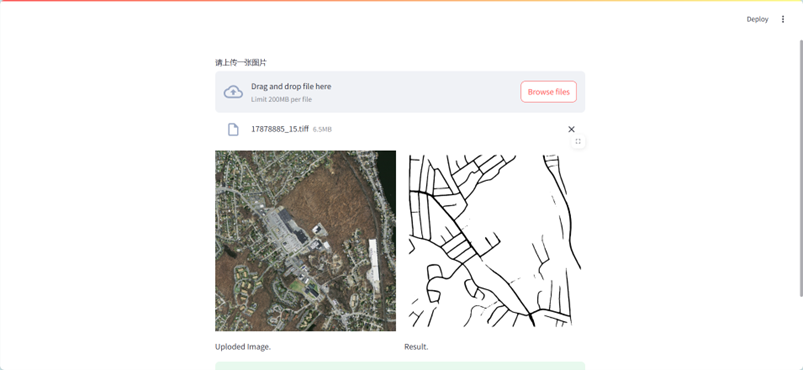

# 基于UGD-DLinkNet的遥感图像道路提取系统

## 安装步骤如下

conda create -n web python=3.11

source activate web

conda install pytorch torchvision torchaudio pytorch-cuda=11.8 -c pytorch -c nvidia

pip install streamlit

注意不要使用requirements.txt进行环境安装，因为在部署阶段streamlit cloud也是直接连接到github仓库中，在streamlit cloud中已经存在streamlit的环境。

## 系统运行代码
在终端切换到当前文件夹的命令下

streamlit run app.py

如果只能使用特定端口（比如AUTODL平台），可使用以下指令指定端口
streamlit run app.py --server.port 6006

## 部署
请参看streamlit官方说明，此代码的环境是python3.11，同样需要在streamlit cloud创建中选择好python版本 https://docs.streamlit.io/

## 部署效果

### 整体效果

### 系统后台界面

### 系统前端网页

### 选择图片上传

### 显示原图与道路提取结果

## 系统说明
上图中左侧是上传的遥感图像，模型推理后将显示右侧的道路提取结果